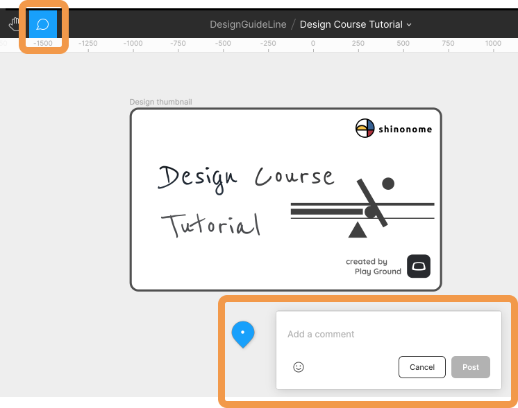
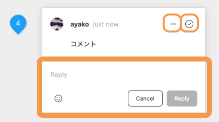

実際に Figma を触って基本的な操作を覚えましょう。  
ここから基本的な操作の説明をしますが、読むだけではなく、自分の課題 `Username`--Design Course Tutorial で実際に手を動かして同じことができるか確認しましょう。

## コメント機能

### コメントを追加する

[[right | ツールバーの 吹き出しアイコンを押すとコメントモードになります。 好きな場所をクリックすると入力ボックスが出てくるのでコメントを書き込みましょう。 SNS のように`@`でメンバーにメンションすることもできます。]]
| 

### コメントに返信する

[[right | コメントを開き、`Reply`から返信することができます。 デザイン仕様について質問があった時などにプロジェクトメンバーとコミュニケーションを取る際に役立ちます。]]
| 

### コメントを編集・削除する

コメントを開き、三点リーダをクリックすることで、`Edit`または`Delete`することができます。  
コメントの場所の変更もできます。

### コメントを解決済みにする

いらなくなったコメントは出来るだけ削除するのではなく、解決済みにすることで非表示にしましょう。  
コメントを開いてチェックマークを押して、解決済みにできます。  
解決済みにしたコメントも`Show resolved comments`にチェックをつけることで確認することができます。  
解決済みに間違えてしてしまった場合も同じ方法で戻せます。  
プロジェクトメンバーとのやり取りは残しておくこと、コメント欄は常にスッキリさせておくことを心がけましょう。

### 参考

- [公式ドキュメント](https://help.figma.com/hc/en-us/articles/360039825314-Getting-started-with-comments)

### Study Diary を書きましょう！

#### 今回やったこと

- コメント機能
- コメントの CRUD(クラッド)機能 (調ベテミテネ)
- コメントの解決

できたら次に進みましょう。
