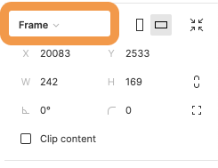

## フレームセレクションとグループセレクション

グループ化には 2 種類あります。場合に応じて、使い分けましょう。

### フレームセレクション

[[right | フレームを入れ子状のグループにすることです。 フレームのグループの場合、親フレームのサイズを変更すると、ネストされたものは右サイドバーの`Constraints`(後述します)の設定に合わせて変化します。 また`Auto layout`(後述します)などの制約もつけられます。 以下のような場合にフレームセレクションを使います。]]
| 

- 複数のオブジェクトをまとめて管理したい時
- 複数のオブジェクトに背景をつけたい時

### グループセレクション

ただ単にグルーピングをしたい時はグループセレクションを使いましょう。  
複数のオブジェクトを１つのレイヤーとして扱うことができます。

### 切り替える

[[right | フレームセレクションとグループセレクションを切り替えることができます。 下の画像は frame を選択している時の右サイドバーの様子です。 frame と書かれているプルダウンから group に変更することができます。 逆も同様です。]]
| 

### グループとフレームの違い

グループとフレームの違いは、Constraints と Auto layout があるかないかです。  
詳しくはこのあと出てくるのでここで違いがわかっていなくても大丈夫です。  
基本的に案件ではフレームを使うことがほとんどなのでとりあえずはフレームを使うと間違い無いと思います。

### 参考

- [公式ドキュメント](https://help.figma.com/hc/en-us/articles/360039832054-Frames-and-Groups)

### Study Diary を書きましょう！

#### 今回やったこと

- フレームセレクション
- グループセレクション
- フレームセレクション ⇄ グループセレクション

できたら次に進みましょう。
