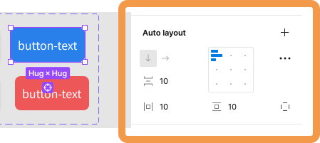
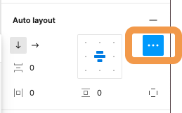
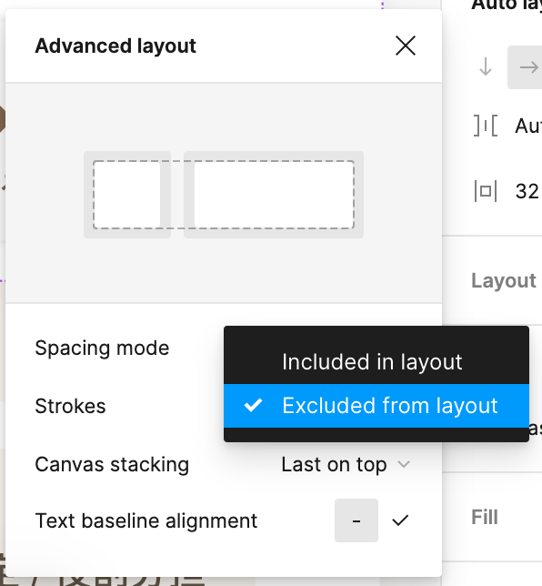
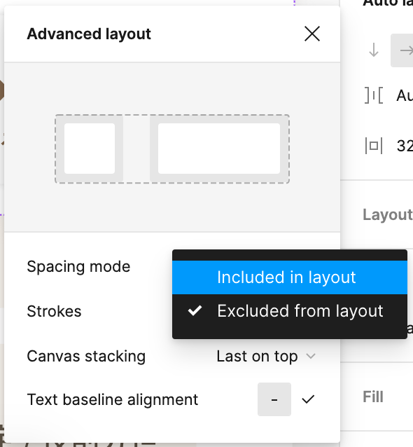
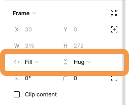

## Auto layout

Auto layout 機能とは padding(余白) を自動で調整してくれたり、要素をリストのように等間隔で並べたい時などに重宝する機能です。  
Auto layout には主に 3 つの機能があります。

- padding(余白)をつける
- 等間隔に並べる
- Advanced layout
- Absolute position

順番に見ていきましょう。

### Auto layout を適用する

[[right | Auto layout 機能を使いたいオブジェクトを選択して右サイドバーのプロパティパネルから Auto layout をつけましょう。<br/>グループまたはフレームセレクションにつけることが可能です。]]
| 

### 1.padding(余白) をつける

[[right | ボタンを例に見てみましょう。<br/>Auto layout 機能ができるまでは中身のテキストに合わせて何種類ものパーツを作る必要がありました。<br/>下の画像は Auto layout 機能の`padding 10px`を適用したものです。]]
| 

[[right | 枠線の部分で padding が左右・上下設定できます。<br/>2枚目右側のアイコンをクリックすることで入力欄が分かれ、上下左右別々の値を設定することもできます。<br/>入力欄を`Command + クリック`で上下左右まとめて設定することもできます。]]
| 

### 2.等間隔で並べる

[[right | 要素を等間隔で並べる際も Auto layout が役立ちます。<br/>要素の追加・削除はもちろん、並び替えもとても簡単にできるようになります。<br/>画像はボタンを等間隔に並べています。<br/>左側の枠線で囲われている部分の矢印で横向きまたは縦向きに並べるのか設定でき、数値を変えることで間隔を調整することができます。]]
| 

### 3.Advanced layout

ここからは Advanced layout の項目について説明します。  
とても理解しづらいと思いますが数をこなして体で覚えていきましょう。  
[[right | Advanced layoutは画像の3点リーダーをクリックして現れるウィンドウ内の機能です。<br/>順番に見ていきましょう。]]
| 

#### Spacing mode

Spacing mode は名前の通り、間隔を設定することのできる機能で 2 種類あります。

```
・Space between: アイテムを均等に配置し最初のアイテムは先頭に寄せ、最後のアイテムは末尾に寄せる
・Packed: 余白通り配置(通常配置)
```

Space between は後述する Resizing を Hug 以外に設定しないと意味がないので注意が必要です。

| Space between                                 | Packed                                      |
| --------------------------------------------- | ------------------------------------------- |
|  |  |

ここからはそこまで重要ではないかつわかりやすいので画像のみの説明にします。  
Preview に表示されるので想像がつくかと思いますが、それでもわからない場合は自分で手を動かしてみたり公式ドキュメントを検索してみてください。

#### Strokes

| Excluded                                        | Included                                        |
| ----------------------------------------------- | ----------------------------------------------- |
|  |  |

#### Canvas stacking

| First                                                     | Last                                                    |
| --------------------------------------------------------- | ------------------------------------------------------- |
|  |  |

#### Text baseline alignment

| -                                   | ✔︎                                              |
| ----------------------------------- | ----------------------------------------------- |
|  |  |

### Resizing

Auto layout で重要なものの 1 つが Resizing です。  
Auto layout を適用している frame の幅や高さがどのように振る舞うべきか設定できる機能です。

| resizing                        | 種類                                      |
| ------------------------------- | ----------------------------------------- |
|  |  |

Resizing には以下の３種類があります。

```
・Hug contents: 子要素の幅に合わせて可変
・Fill container: 親要素いっぱいに広げる
・Fixed width/height: 幅/高さ固定
```

この辺りは慣れが必要なので、サイトでよく使われるパーツはどういう風に作れるか考え、手を動かすなどの努力が必要です。  
[参考リンク](https://bagelee.com/design/figma-auto-layout-update/)

### 参考

- [公式ドキュメント](https://help.figma.com/hc/en-us/articles/360040451373-Create-dynamic-designs-with-Auto-layout)

### Study Diary を書きましょう！

#### 今回やったこと

- Auto layout
- Advanced layout
- Resizing

できたら次に進みましょう。
