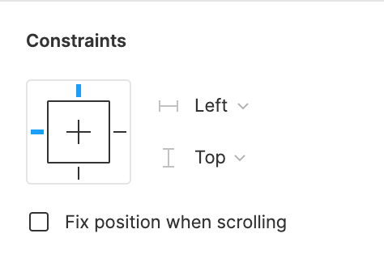
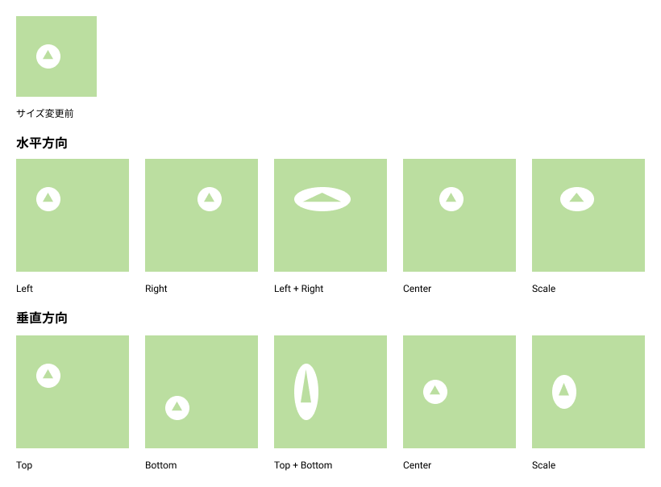

## 制約(constraints)

constraints を設定することによって、フレームのサイズが変わった時に、子要素のオブジェクトがどのような変化をするのか制約をつけることができます。  
これによって、Web ページのデザインをする際、デバイスが変わった時にどのような表示されるかを制御でき、コンポーネント化と組み合わせて使うことによって、UI デザインのシステム構築が効率的にできます。
使い方を学んでいきましょう。

### 使い方

[[right | フレームオブジェクトの子要素を選択すると右サイドバーのプロパティパネルの以下の Constraints が現れます。 グループセレクションには現れないので注意をしてください。]]
| 

### 仕様

[[right | 以下の画像はフレームオブジェクトにそれぞれの制約をつけ、大きさを変えたものの一覧です。 制約によってサイズ変更をすると違った振る舞いをすることがわかると思います。 デバイスが変わった時にどのような挙動をするべきか考える時に用いて試してみましょう。]]
| 

### constraints の無視

`commandキー(ctrl)`を押しながらサイズ変更をすることで constraints を無視したサイズ変更が可能です。

### 参考

- [公式ドキュメント 1](https://help.figma.com/hc/en-us/articles/360039957734-Apply-Constraints-to-define-how-layers-resize)
- [公式ドキュメント 2](https://help.figma.com/hc/en-us/articles/360039957934-Combine-Layout-Grids-and-Constraints)

### 個人シートに学んだことを記入しましょう！

#### 今回やったこと

- constraints 機能

できたら次に進みましょう。
