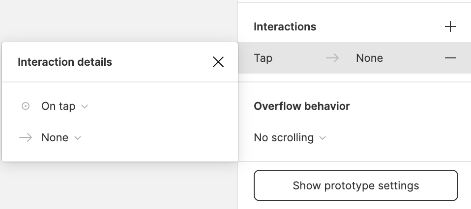
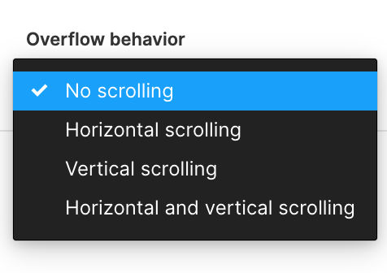

## プロトタイピング

プロトタイピング機能を使うことで、リンクや画面の遷移をつけたプロトタイプを作ることができます。

### プロトタイプとは

プロトタイプは制作した UI に近い形でデザインを確認することができる機能です。  
実装前に問題点を洗い出したり、概念をテストすることによって作業の後戻りをある程度防ぐことができます。

### プロトタイプモードに切り替える

[[right | プロトタイプを作るには右サイドバーのプロパティパネル上部からモードを切り替えます。<br/>上から順に見ていきましょう。]]
| 

### Interactions

[[right | `Interactions`の+ボタンを押すと、以下のようなものが現れます。<br/>`Tap -> None`と書いてある部分をクリックすると詳細設定ウィンドウが現れます。<br/>詳細ウィンドウで設定することは以下です。]]
| 

```
・trigger: クリック・ホバーなどどんなアクションをきっかけにページが変わるか
・actions: どのようにページが変わるのかなど
・遷移先
```

スマホは`tap`,PC は`click`がトリガーであることに注意が必要です。

| trigger                                                 | actions                                                 |
| ------------------------------------------------------- | ------------------------------------------------------- |
|  |  |

### Overflow behavior

[[right | 英語の通り、デバイスからはみだしている場合、どのような挙動をするか設定できます。]]
| 

### Show prototype settings

[[right | プレビューするデバイス、プレビューの背景、最初のフレームを設定できます。]]
| 

### Figma Mirror

実機で確認したい場合、`Figma Mirror`というスマホアプリを使うことで Wi-fi 経由でプレビューを見ることができます。  
[https://www.figma.com/mirror](https://www.figma.com/mirror) にアクセスすることで別タブでプレビューを見ることもできます。

### 参考

- [公式ドキュメント ~アニメーションの緩急~](https://help.figma.com/hc/en-us/articles/360051748654-Prototype-easing-curves)
- [公式ドキュメント ~animation~](https://help.figma.com/hc/en-us/articles/360040315773-Prototype-interactions-and-animations)
- [公式ドキュメント ~overflow behavior~](https://help.figma.com/hc/en-us/articles/360039818734-Prototype-scrolling-with-overflow-behavior)

### Study Diary を書きましょう！

#### 今回やったこと

- プロトタイピング 機能

できたら次に進みましょう。
