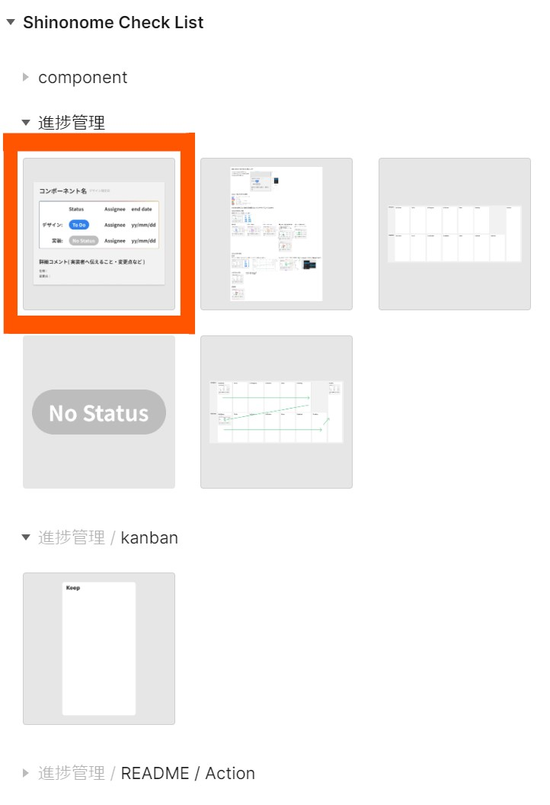

既に出来上がっているサイトから逆算し、画面遷移図、パーツのトレースができるようになりました。  
この最終セクションでは、Web デザインができるまで実際にどのようなフローがあるのか学んでいきましょう。

## Web デザイン完成までの流れ

### 1. 仕様書を元に画面遷移図を作成する

画面遷移図を作り、作るサービスの全体像を掴みましょう。  
仕様書の文言からサービスの流れ、デザインをイメージする力が問われます。  
理解できない場合はなるべく早く作成者に問い合わせて解決しましょう。  
画面遷移図の作り方は[ここ](/web/chart)を見て復習してください。

### 2. ワイヤーフレームを作成する

[[right | 次はワイヤーフレーム(骨組み)の作成をします。 ワイヤーフレーム とはどこにどのパーツが配置されるかを大まかに示したものです。 デザインはここでは考えず、最低限の機能が伝わるよう作成します。 作成後チーム内に共有、クライアントに提出し、認識のすり合わせをします。 この画像はあるプロジェクトのヘッダーのワイヤーフレーム です。]]
| 

### 3. エンジニア向けの説明を作成する

[[right |ワイヤーフレーム ができたらエンジニア向けのページを作成します。 １フレームを１パーツまたは１ページの説明となるように作成します。 この画像はあるプロジェクトのエンジニア向けの説明です。 この作業をすることによって、見やすく、管理がしやすくなります。 ・説明するロジックパーツ(左上) ・ワイヤーフレーム (画像はデザインカンプ) ・仕様書の文言 ・周辺の画面遷移図 を置くとわかりやすいでしょう。]]
| 

### 4. クライアント・ターゲットを分析する

その Web サービスを使うユーザーの層やクライアントの分析をし、コンセプトを決めましょう。  
例えば、セブンイレブン・ローソン・ファミリーマートなどを思い浮かべましょう。  
それぞれなんとなく色のイメージがあるはずです。  
このように、クライアントや作る Web サービスには特色があるはずです。  
これらを確認することによって、配色のイメージや全体的に気をつけるべき点が明確になるでしょう。  
Figma のコンセプトのページに色の考え方を載せていますからそれも参考にしてください。  
参考: [色相環で考える](https://sevendex.com/post/7275/)  
参考 2: [デザイナーじゃなくても知っておきたい色と配色の基礎知識](https://baigie.me/officialblog/2021/01/27/color_theory/)

フォントは、[Google font](https://fonts.google.com/)から選ぶことが多いです。  
日本語に対応しているフォントか確認を忘れずにしましょう。  
デザインカンプを作りながらフォントを考えるのでも構いません。  
Figma 上で試す場合は[おすすめプラグイン](/figma/section5/)の Japanese Font Picker が役立つと思います。  
実際に使う場合はダウンロードすると Figma 上で使えるようになります。

### 5. デザインカンプを作成する

ワイヤーフレームを肉付けするようにデザインを完成させていきましょう。  
配色にもこだわりましょう。  
同じ色を使っても使う面積によって与える印象はガラッと変わります。

1. どのパーツを用いて表現するか考える
   [https://csslayout.io/](https://csslayout.io/)があらかたのパーツを網羅しています。  
   参考にしてください。
2. コンセプトにあったデザイン例を探す
   [dribbble](https://dribbble.com/)などでパーツ名を検索しイメージを膨らませましょう。

適宜参考にしてください。 [素材集](/wisdom/tips/)

### 6. UX 検証

ユーザビリティ（使いやすさ）・UX（心地よさ）を検証します。  
Figmaのプロトタイプを設定して確認すると、UX検証がしやすくなります。
例えば快適にスクロールできるか・上部に戻れるか、ラジオボタンのクリック領域を広げたり、テキスト入力を補助したり`ユーザーの労力を減らし、快適に使えるか`を考えます。  
企業サイトのブランドイメージを高めたり、通販サイトの購買数を増やすことになり、後の保守に繋がるのでとても大切な検証となります。  
いくらサイトがおしゃれでも使ってくれるユーザーがいなければ何の意味もありません。  
**これらの検証は 1 人で行うのではなく、大人数の意見を聞くことが大切です。**

### 7. Atomic Design

[[right |デザインカンプのUX検証が終わると、いよいよatomic designです。 使いまわしができる（汎用的な）パーツを見つけコンポーネント化しましょう！ component configuration、又は、CheckCard（右画像）を使ってホバーアクションなどの仕様を記載しましょう。 CheckCardの使い方はassetsでCheckCardの隣に置いているので確認してください。]]
| 

### まとめ

これらの順番は固定ではありません。  
プロジェクトによっても変わりますし、同時進行で作業を進めたり、戻ったりもします。  
時と場合によってこのフローをプロジェクトに合った形に変えていきましょう。

### 個人シートに学んだことを記入しましょう！

#### 今回やったこと

- Web デザインの流れ

できたら次に進みましょう。
