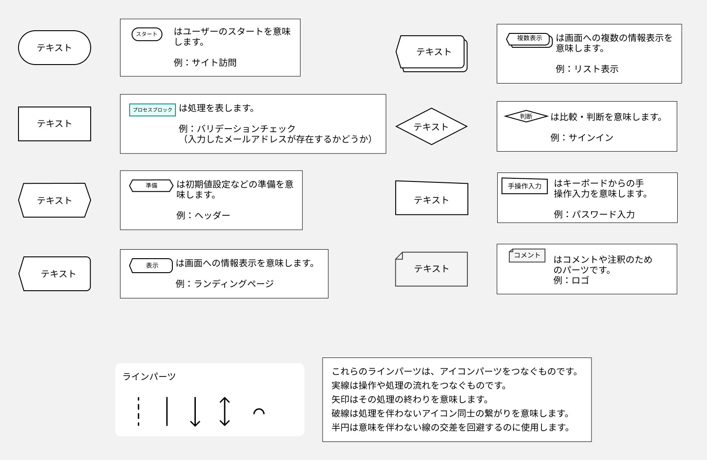
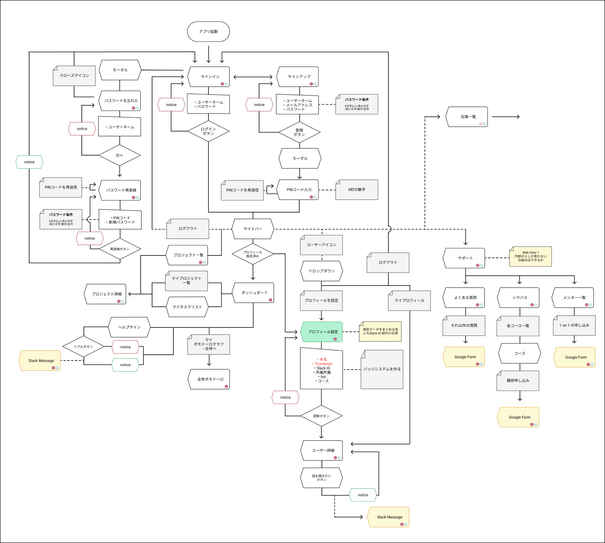

### 画面遷移図とロジックパーツ

プロジェクト進行において、要件を形にする際に、簡易なアイコンとラインを用いてシステムを設計したり整理します。  
そこで使うアイコンやラインのことを、`ロジックパーツ`と呼んでいます。  
このパーツを使って作る図を、`フローチャート`、あるいは`画面遷移図`と呼びます。

`フローチャート`とは、処理やユーザーが利用する際の流れを図にしたものです。  
`画面遷移図`とは、Web ページの遷移を図にしたもので、表示されるページを主体に操作などの注釈を加えたものが多いです。つまり、画面遷移図も一つのフローチャートです。  
これらはフレームワーク設計やコーディングの前に、目標物の共有やその後の設計をスムーズにするために制作します。書き方の形式やルールに一定の決まりはなく、目標物の性質や設計の段階、環境、誰に伝えるかによって、どういった形式が採用されるかが決まります。

### 例

フローチャートの書き方には色々なものがありますが、ここでは Playground で使われている形式のフローチャートについて学びます。
まずは元になっている[ロジックについて](http://www.cs.shinshu-u.ac.jp/Lecture/Prog2/Prog1/class04.pdf)を一読してから次に進みましょう。

以下は、Playground のフローチャートに使われるロジックパーツとその説明です。

Play Ground のプロジェクトでは、基本的にこれらのパーツを使ったフローチャートを制作します。
例えばサイト制作などで、ページのイメージをする前の段階で、これらのパーツを使って画面遷移図を制作します。
必要があれば、これらのパーツにさらに、色分けやアイコンを追加して使用します。

下図は、これらのパーツを使い、実際に作られた Playground Desktop App のフローチャートです。

### パーツの使い方

これらのロジックパーツはプロジェクト共通のものです。  
パーツを使う際は、Figma 左上の`Assets`→`Shinonome Logic parts` から使用しましょう。  
また、オリジナルのアイコン等を作る場合は、必ずコンポーネント化しましょう。  
**※Assets にローカルのパーツしかない場合は Assets の本のアイコンから、Shinonome Logic parts が適用されているか確認しましょう。**

### 全て読んだら

1. この章で学んだことを Study Diary に書き、今回学んだ部分にチェックをつける。  
   ※この章に関する課題はありません。次に進みましょう！
