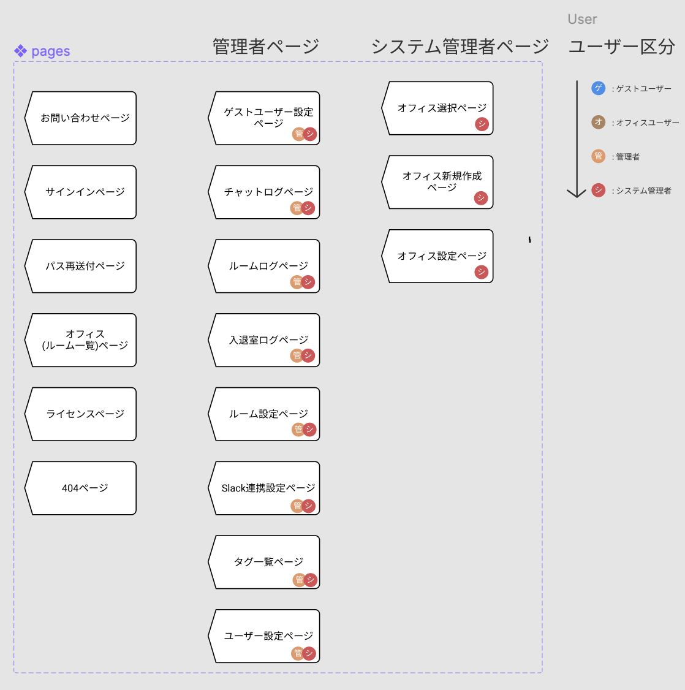
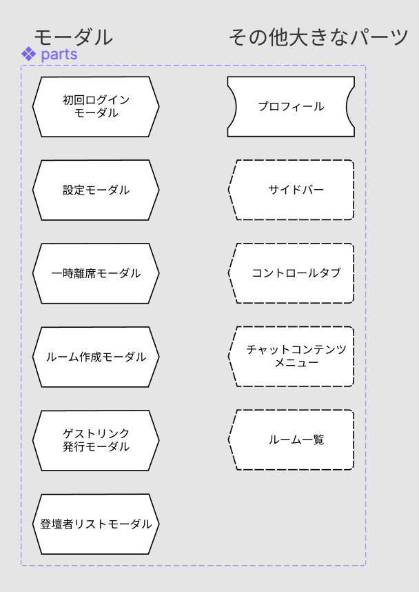

それでは実際にパーツを使って、画面遷移図を作ってみましょう。  
今回は要件を見て一から図を作るのではなく、既に完成している[デモサイト](https://demo.tcd-theme.com/tcd063/)から、設計段階の画面遷移図を逆算して作ります。  
`Username`--Design Course Tutorial の`ロジックについて`と書かれたページで制作していきましょう。  
以下の手順でこの課題に取り組んでください。

### 1. 全ページを一覧にする

[[right | まずは、デモサイトにいくつページがあるのか数えましょう。 そしてページ一覧としてまとめておくことでエンジニアが何ページ作成すればいいのか把握できます。 コンポーネント化はロジックパーツでも例外ではありません。 同じパーツを使い回す場合は必ずコンポーネント化・Variants 機能を使いましょう。 この画像はある案件のページ一覧です。]]
| 

### 2. 共通パーツを一覧にする

[[right | 次に共通パーツを洗い出しましょう。 共通パーツとは、ヘッダーやフッター、サイドバーなど複数のページに配置されるパーツのことです。 こちらも忘れずにコンポーネント化・Variants機能を使いましょう。 この画像もある案件の共通パーツ一覧です。]]
| 

### 3. 画面遷移図を作る

ページ一覧と共通パーツ一覧が作成できたら、画面遷移図を早速作っていきましょう。  
どう表現したらわかりやすいか、自分なりに工夫して作ってみましょう。

### 解答ができたら

1. バージョンを保存する [参考](https://design-basic.netlify.app/figma/section2-3/)
2. この章で学んだことを Study Diary に書き、今回学んだ部分にチェックをつける。
3. 提出するページのリンクをコピーする。
4. PGrit でページのリンクと、`#design_review`のタグをつけてレビューを依頼する。
5. レビューで指摘されたことがあれば修正し、再び 1 から繰り返す。

**レビューは 48 時間以内に行います。それ以上時間が経っている場合はレビュワーが見落としているの遠慮なく再度レビュー依頼をしてください。**  
レビューは基本的にコメントで行います。  
レビューされたら Figma 上で確認、コメントの意味がわからなければ reply をして`#design_review`のタグをつけて PGrit にその旨を投稿してください。

**※shinonome チームの Design Course Tutorial を編集しないように気をつけてください！万が一してしまった場合は気づいたらすぐに教えてください！**
