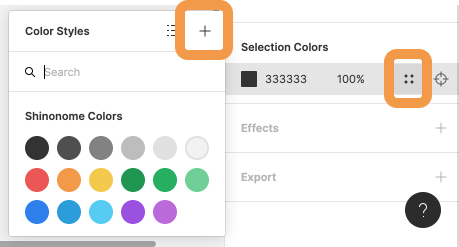

### スタイルの登録

Figma では、以下のスタイルを登録することができます。

- カラー
- テキスト
- シャドウ
- フォント

登録することによって、使っているスタイルが可視化され、エンジニアが実装しやすく、サイト全体の統一感にも繋がります。  
以下の画像を見てみましょう。

| カラースタイル                         | テキストスタイル                     |
| -------------------------------------- | ------------------------------------ |
|  |  |

カラーやテキストの指定をしている部分をホバーすると`４つのドット`が出現し、すでに登録されているスタイルを選択・適用したり、`+`ボタンから新しく登録することができます。  
使う際は必ず登録するようにしましょう。

### Shinonome のテキスト

Shinonome ではテキストを`atoms/text`と位置付けてコンポーネントを統一して使っています。  
右サイドバーの`Assets`の`Shinonome Text Styles`から`text-wrap`を持ってきて構造を見てみましょう。  
テキストが`margin`と`padding`という名前の Auto layout でラップされているのがわかると思います。  
これからテキストを使う際には **Shinonome の text-wrap を使いましょう。**

- `text-wrap--margin` は外側の余白で他の要素との余白を取る際に用います。
- `text-wrap--padding` は内側の余白で、自分の要素の余白を取る際に用います。  
  margin と padding の違いをしっかりと理解しましょう。

| text-wrap                         | margin と padding                       |
| --------------------------------- | --------------------------------------- |
|  |  |

#### テキストの命名

基本的には`Shinonome Text Styles`のスタイルを用いましょう。  
文字の大きさは`h1`,`h2`,`h3`,`XL`,`L`,`M`,`S`,`XS`,`XXS`の 9 種類に分かれています。  
こちらも`/`で区切ることによって階層が分かれて管理がしやすいです。  
Shinonome Text Styles では font-weight の普通・太いの 2 種類で`h1/basic`,`h1/bold`のように登録しています。  
h1,h2,h3 は見出しを表すものです。  
Shinonome 以外のフォントを使いたい場合は`フォント名/サイズ`のように命名してください。

#### カラーの命名

カラーの命名には[HTML CSS Color Picker](http://www.htmlcsscolor.com/)を使います。

命名規則は以下です。

- 色名は`基本色名_詳細色名`で表す
- 基本色名は Color Wheel の 6 色（`red, orange, yellow, green, blue, violet`）と白黒灰 3 色(`white, black, gray`) を合わせた 9 色を使う
- 詳細色名は [HTML CSS Color Picker](http://www.htmlcsscolor.com/)で検索してヒットした色名を使う
- **基本小文字**で命名し、2 単語以上になる場合は 2 単語目以降の頭文字を大文字で表現する
- 色の並べ方は`white->gray->blue->green->yellow->orange->red->violet->black`
- 透明度が 100%でない場合は`基本色名_詳細色名_透明度`のようにする

理由は[この記事](https://qiita.com/gotchane/items/5a84c6acd9312f70be77)を参照してください

| テキストの命名                                            | カラーの命名                                                 |
| --------------------------------------------------------- | ------------------------------------------------------------ |
|  |  |

### 参考

- [公式ドキュメント ~text styles~](https://help.figma.com/hc/en-us/articles/360039957034-Create-and-Apply-Text-Styles)
- [公式ドキュメント ~color styles~](https://help.figma.com/hc/en-us/articles/360038746534-Create-styles-for-colors-text-effects-and-layout-grids#Text)

### 個人シートに学んだことを記入しましょう！

カラーはなぜこの命名規則でしょうか？  
自分なりに考えて 個人シート に書いてみてください。

#### 今回やったこと

- テキスト・カラーの登録
- カラー・テキストの命名規則

できたら次に進みましょう。
